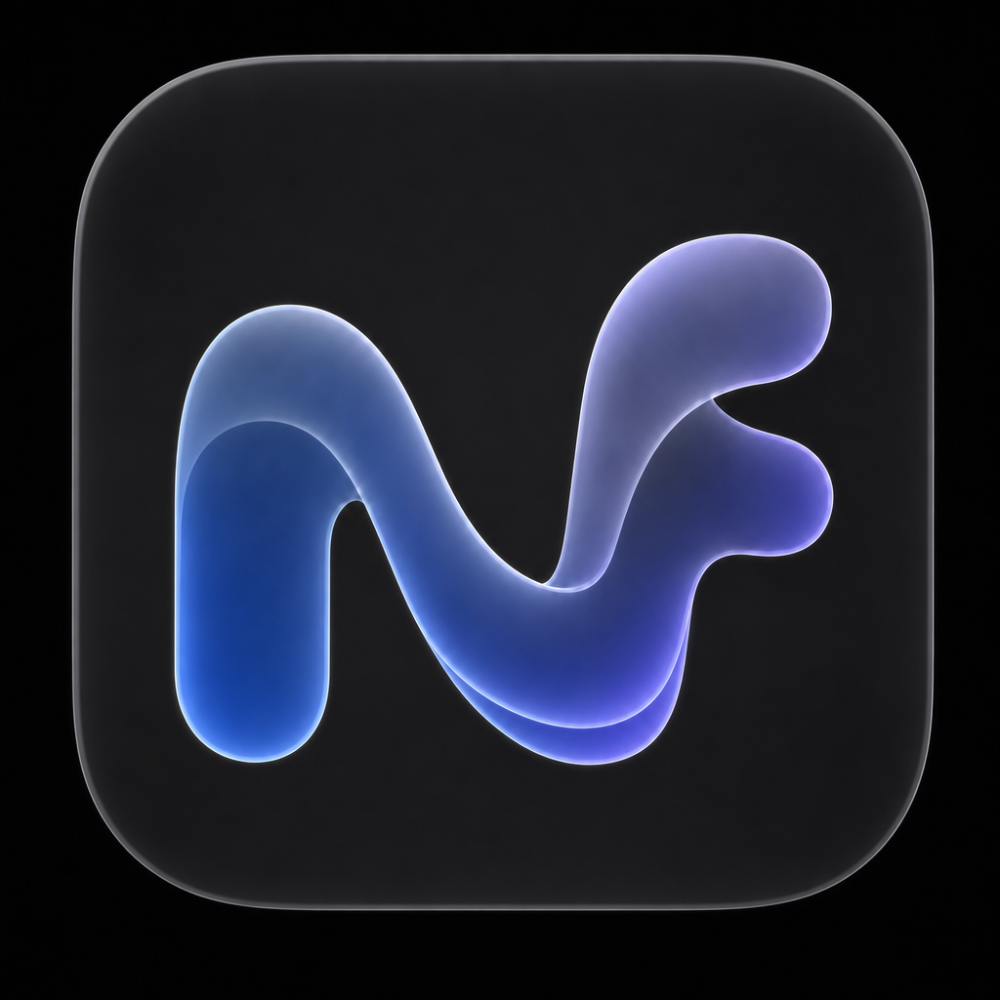
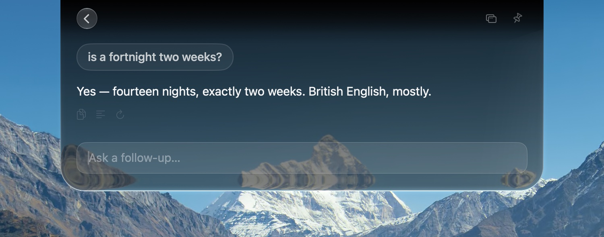
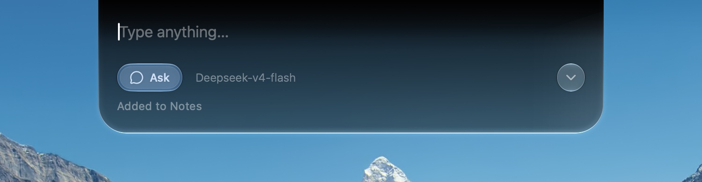
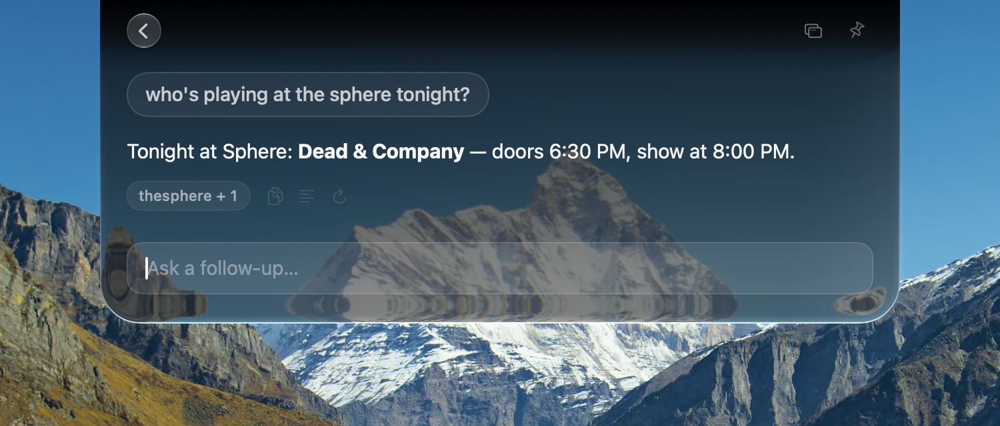
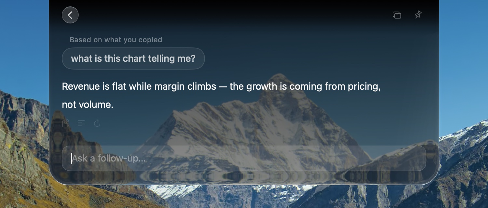
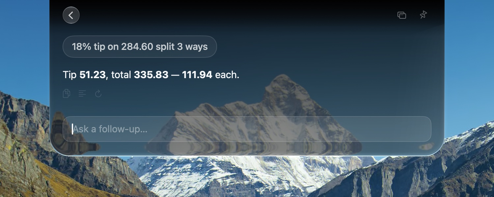

<div align="center">



# NotchFlow

**Your notch, always ready.**

**Ask**, **save a note**, **set a reminder**, or **hand a task to an AI agent** — all from your Mac's notch.

[](https://github.com/sidhxntt/NotchFlow/releases/latest)


[notch.website](https://notch.website) ·
[Release Notes](CHANGELOG.md)

Direct download · Apple silicon · macOS 14+

</div>

NotchFlow is a private macOS companion that brings AI chat, notes, reminders, and coding agents to your Mac's notch. Whatever you type is recognized as a chat, a note, a reminder, or a coding-agent task; prompts and local history stay on your Mac unless you deliberately send them to a provider or service.

## Install

Download the latest release, open the **DMG (primary)**, and drag **NotchFlow.app** to Applications. A matching **ZIP fallback** is available for Macs that cannot mount a disk image.

The command-line installer is optional:

```bash
curl -fsSL https://raw.githubusercontent.com/sidhxntt/notchflow/main/install.sh | bash
```

Or hand it to **Claude Code / Codex**:

> Please install NotchFlow for macOS for me. Run this in my terminal:
> `curl -fsSL https://raw.githubusercontent.com/sidhxntt/notchflow/main/install.sh | bash`
> It is a direct-download menu-bar app (https://github.com/sidhxntt/notchflow).
> After it finishes, confirm NotchFlow is installed in /Applications and launch it.

- NotchFlow requires **macOS 14 (Sonoma) or later**.
- NotchFlow supports **Apple-silicon (arm64) Macs**.
- A hardware notch is optional.
- Tagged releases are Developer ID-signed and notarized by Apple; open the DMG and drag the app to Applications.

## Trial and license

Every new installation begins with a full **seven-day trial** (seven consecutive 24-hour periods from its first successful launch). When the trial ends, NotchFlow blocks every product feature until a valid license is activated.

Choose **Buy License** in the blocked screen or the License section of Settings → About to purchase through Lemon Squeezy. Lemon Squeezy emails your license key after payment succeeds; enter that key in NotchFlow to activate this Mac. You can enter the same key again to restore a purchase on another permitted personal Mac.

A valid paid NotchFlow license is **perpetual**: it keeps the product available forever and includes all future NotchFlow updates. It is not a subscription. NotchFlow has no separate product account; Lemon Squeezy processes the purchase and license-key delivery.

## Automatic intent detection

NotchFlow automatically figures out what you type:

- **Ask** — get an answer instantly
- **Note** — save to Apple Notes or a Markdown file
- **Remind** — turn it into an Apple Reminder
- **Agent** — hand a coding task and a project folder to Codex, Claude Code, Grok, and more



|  |  |
| --- | --- |

## Built-in tools

NotchFlow supports:

- Web search (requires a corresponding API key)
- Opening web links
- Exact arithmetic
- Settings changes

|  |  |
| --- | --- |



## Agent

NotchFlow can drive your **Codex**, **Claude Code**, **Grok**, and other CLIs, with support for follow-up instructions and resuming after an interruption.


## BYOK

- AI services:
  - Including but not limited to: OpenRouter, Vercel AI Gateway, OpenAI, Anthropic, Google Gemini, DeepSeek, Qwen, Kimi, GLM, MiniMax, MiMo, or your own OpenAI-compatible endpoint
  - You can also use a locally installed, signed-in Codex, Claude Code, Grok, or PI CLI
- Web search
  - Including but not limited to: Exa, Keenable, or AnySearch

## Design

NotchFlow is drawn in macOS Liquid Glass — including the edge glow and physical motion of native macOS 26.

## Privacy

NotchFlow has no separate product account. Prompts, chats, notes, reminders, agent sessions, clipboard, and history stay on your Mac, or go directly to the AI provider you configured. NotchFlow does not relay request content.

Read the tracked [Privacy Policy](PRIVACY.md) for permissions, local storage, provider/network use, Lemon Squeezy licensing, retention, and deletion. The same policy is published at the configured in-app [privacy URL](https://sidhxntt.github.io/NotchFlow/privacy/).

## Questions

**Does NotchFlow work on a Mac without a notch?**

Yes. On Macs without a notch and on external displays, NotchFlow draws a virtual notch at the top of the display and behaves the same way.

**Do I need an account or an API key?**

NotchFlow itself has no account. For hosted AI, connect a provider with its API key or supported sign-in flow. Alternatively, use Codex, Claude Code, Grok, or PI through a locally installed CLI that is already signed in. Notes and reminders do not need a provider connection.

**What happens after the seven-day trial?**

NotchFlow blocks every product feature until you activate a valid paid license. Select Buy License to purchase through Lemon Squeezy; it emails a license key that you enter in the app. The paid license is perpetual and covers future updates.

**Will I get future updates?**

Yes. A valid paid license includes all future NotchFlow updates. The app checks for signed updates; the DMG is the normal manual install path and the matching ZIP is a fallback.

**Can I use local models?**

Yes. Add any OpenAI-compatible endpoint in Settings; this works for Ollama, LM Studio, vLLM, self-hosted gateways, and providers NotchFlow does not list. A key is optional for custom endpoints.

**Can I ask about screenshots or images?**

Yes, with a vision-capable Ask model.

**Can NotchFlow run Codex, Claude Code, Grok, or PI?**

Yes. Agent mode runs the official CLI you already installed and signed in to, inside the project folder you choose.

**Where does my data go?**

NotchFlow does not operate a user-data backend. AI prompts and deliberately added context go to the provider or CLI you selected; web-search requests go to the configured search service. Notes, reminders, local history, clipboard contents, and local files otherwise remain on your Mac.

**Why does NotchFlow ask for system permissions?**

NotchFlow needs permission for Notes automation, Reminders, and notifications. Settings → General shows the status of each authorization.

**How do I uninstall NotchFlow?**

Drag `NotchFlow.app` from `/Applications` to the Trash.

## Developers

Open `NotchFlow.xcodeproj` (Xcode 16+), or run `./scripts/reinstall.sh`.

## Product license

The downloadable NotchFlow product requires a valid Lemon Squeezy license after its seven-day trial. A paid license is perpetual and includes all future NotchFlow updates. NotchFlow's source and product are proprietary; applicable third-party and Notchi-derived notices are available in [THIRD_PARTY_NOTICES.md](THIRD_PARTY_NOTICES.md) and in the app.
